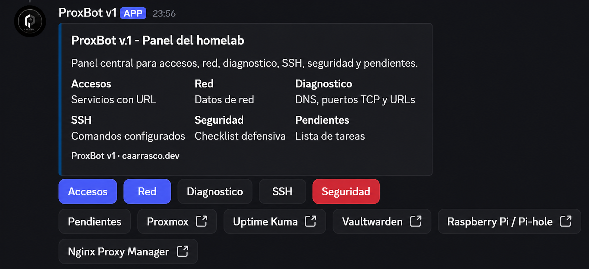
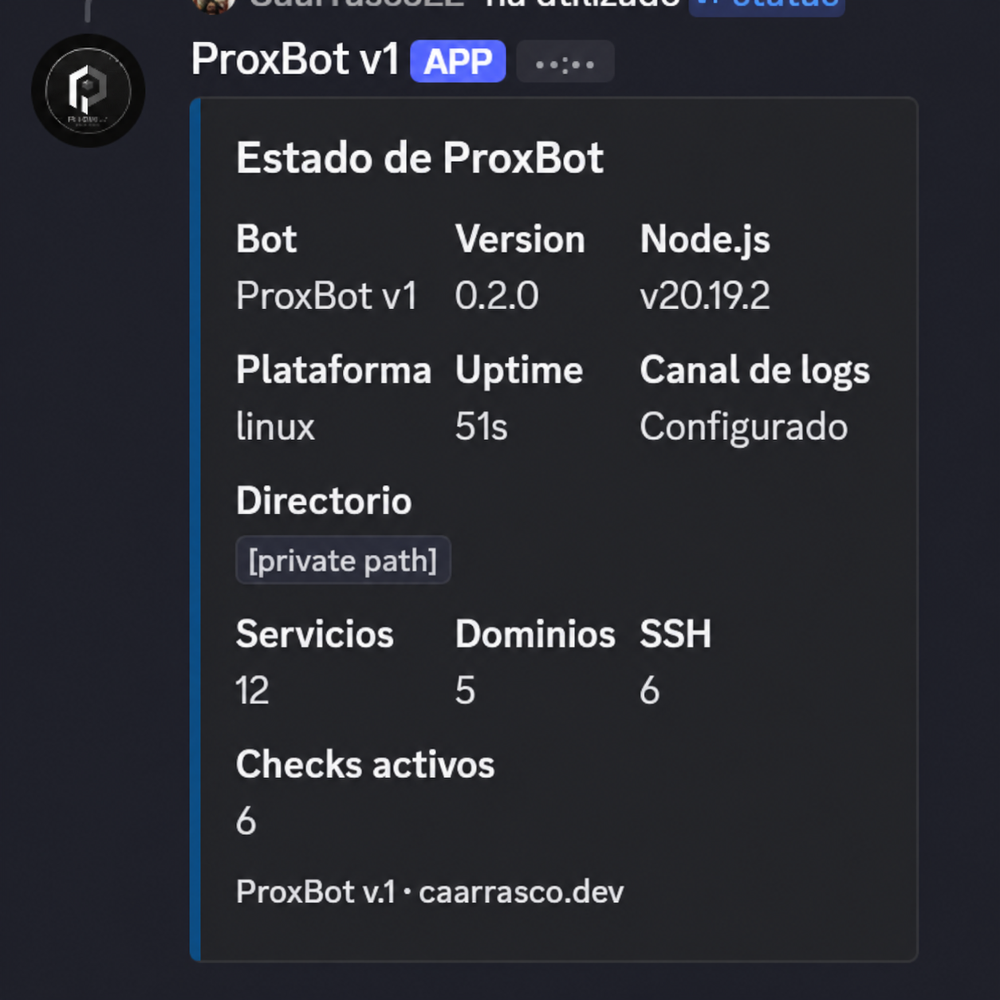
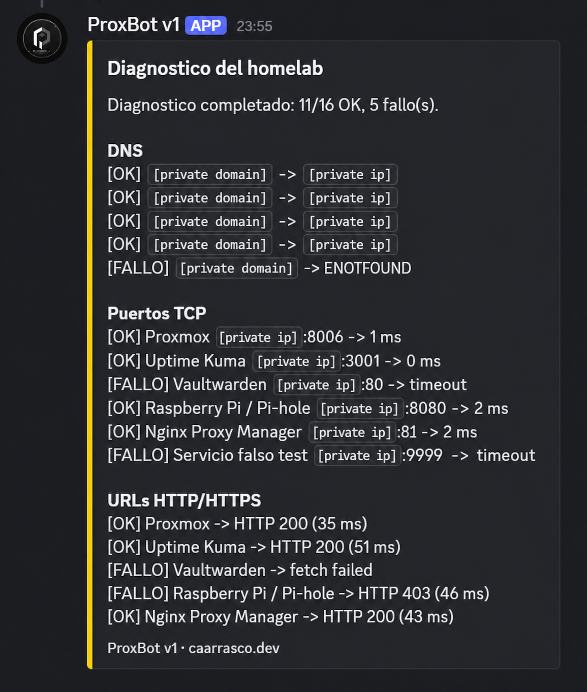
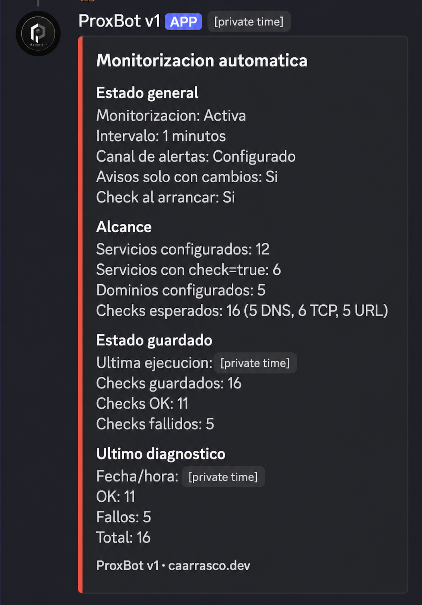
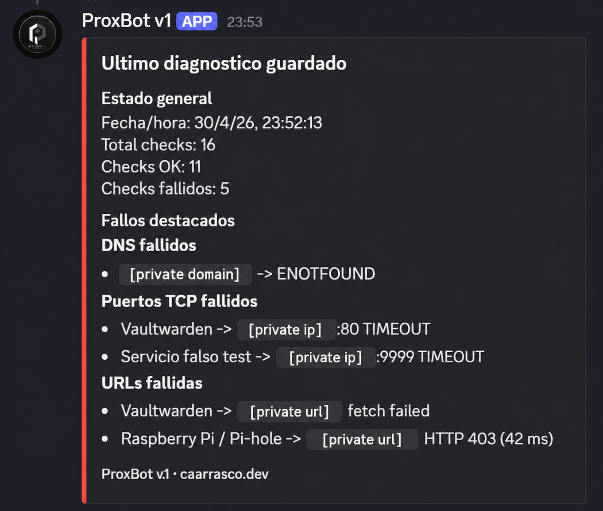

# ProxBot v.1

[Spanish version](README.md)

ProxBot v.1 is a configurable Discord bot for homelabs. It works as a quick Discord panel, service inventory, SSH cheat sheet, simple notes tool, and real diagnostic helper for home networks and self-hosted services.

The core idea is simple: the code does not know your homelab. Services, IPs, domains, ports, SSH commands, pending tasks, and security notes live in `config.json`.

## Who It Is For

- Homelab users who want a Discord-based control panel.
- People running small servers, Raspberry boards, virtualization hosts, or internal services.
- Users learning networking, DNS, TCP ports, and basic administration.
- Anyone who wants to document their infrastructure without hardcoding values in code.

## What It Does

- Provides a main Discord panel with buttons.
- Lists services, IPs, domains, and SSH commands.
- Provides a basic homelab inventory and service cards from `config.json`.
- Runs real DNS, TCP port, and HTTP/HTTPS diagnostics.
- Generates URL buttons from `config.json`.
- Stores simple notes with `/log` and `/verlog`.
- Shows installation status with `/status`.
- Shows automatic monitoring status with `/monitor`.
- Shows the latest saved diagnostics with `/ultimodiagnostico`.
- Shows backup documentation with `/backups`.
- Shows maintenance task documentation with `/mantenimiento`.
- Configurable basic permissions via Discord roles (optional, disabled by default).
- `/proxmox` command to query Proxmox VE in read-only mode (optional, disabled by default).
- Supports guided setup with `npm run setup`.
- Includes an optional Proxmox VE installer for deploying ProxBot in a Debian LXC.

## What It Is Not

- It is not a replacement for Uptime Kuma, Grafana, Prometheus, or a SIEM.
- It is not an enterprise monitoring platform.
- It does not install or secure your self-hosted services.
- It must not store tokens, passwords, or private keys in the repository.

## Before You Install

Prepare:

1. A Discord account.
2. A Discord server where you can invite bots.
3. A Discord Developer Portal application.
4. `DISCORD_TOKEN`.
5. `DISCORD_CLIENT_ID`.
6. `DISCORD_GUILD_ID`.
7. Optional `CHANNEL_LOGS_ID`.
8. A list of services you want to add.
9. For each service: name, IP/host, port, URL, SSH command, local domain, and whether it should be diagnosed.
10. Working local DNS if you use `.lab`, `.local`, or similar domains.
11. Linux permissions if you plan to use `scripts/install.sh` or systemd.

## Quick Install

```bash
git clone https://github.com/Caarrasco22/proxbot.git
cd proxbot
npm install
cp .env.example .env
npm run setup
```

On Windows PowerShell:

```powershell
copy .env.example .env
npm.cmd install
npm.cmd run setup
```

Manual alternative:

```bash
npm run init-config
```

Then edit `.env` and `config.json`.

### Manual Install vs Setup vs install.sh

- `npm run init-config`: only copies `config.example.json` to `config.json` if it does not exist.
- `npm run setup`: interactive assistant to create or update `.env` and `config.json` with backups.
- `scripts/install.sh`: Debian/Ubuntu installer; installs packages, clones into `/opt/proxbot`, can run setup, deploy commands, and create systemd.

## Discord Developer Portal Setup

1. Open [Discord Developer Portal](https://discord.com/developers/applications).
2. Click **New Application**.
3. Name it, for example `ProxBot`.
4. Open the created application.

### Create the Bot and Get `DISCORD_TOKEN`

1. Open **Bot**.
2. Create the bot if Discord asks for it.
3. Copy or reset the token.
4. Put it in `.env`:

```env
DISCORD_TOKEN=your_token
```

The token is secret. Do not share it, do not push it to GitHub, and do not paste it in screenshots.

### Get `DISCORD_CLIENT_ID`

1. Open **General Information**.
2. Copy **Application ID**. In OAuth2 it may also appear as **Client ID**.
3. Put it in `.env`:

```env
DISCORD_CLIENT_ID=your_client_id
```

### Get `DISCORD_GUILD_ID`

`Guild ID` means the Discord server ID where slash commands are registered.

1. In Discord, open **User Settings > Advanced**.
2. Enable **Developer Mode**.
3. Right-click your server.
4. Click **Copy ID**.
5. Put it in `.env`:

```env
DISCORD_GUILD_ID=your_guild_id
```

### Get `CHANNEL_LOGS_ID`

This is optional. It lets `/log` send notes to a specific channel.

```env
CHANNEL_LOGS_ID=your_logs_channel_id
```

If you do not want it:

```env
CHANNEL_LOGS_ID=
```

### Complete `.env` Example

```env
DISCORD_TOKEN=your_token
DISCORD_CLIENT_ID=your_client_id
DISCORD_GUILD_ID=your_guild_id
CHANNEL_LOGS_ID=your_logs_channel_id
```

## Invite the Bot

In **OAuth2 > OAuth2 URL Generator**, select:

```text
bot
applications.commands
```

Recommended minimum permissions:

```text
Send Messages
Use Slash Commands
Embed Links
Read Message History
```

Open the generated URL and authorize the bot in your server.

## Configure `config.json`

Use the guided setup:

```bash
npm run setup
```

Or create it from the template:

```bash
npm run init-config
```

Then validate:

```bash
npm run check-config
```

More details: [docs/CONFIG.md](docs/CONFIG.md). Examples: [docs/examples](docs/examples).

## Inventory

The inventory is also available from the `Inventario` button in `/panel`.
`/inventario` and `/servicio-info` show service documentation from `config.json`
in read-only mode. They do not execute commands, do not run network checks and do
not call external APIs.

Full guide: [docs/INVENTORY.en.md](docs/INVENTORY.en.md).

## Backups and Maintenance

Backups and maintenance tasks are available from the `Backups` and
`Mantenimiento` buttons in `/panel`.

`/backups` and `/mantenimiento` show operational documentation from
`config.json` in read-only mode. They do not run real backups, restore data,
restart services, or call external APIs.

Full guides:
[docs/BACKUPS.en.md](docs/BACKUPS.en.md) and
[docs/MAINTENANCE.en.md](docs/MAINTENANCE.en.md).

## Diagnostics

`/diagnostico` and the Diagnostico panel button run the same real checks:

- `domains`: DNS lookup with `dns.lookup()`.
- `services` with `check: true`, `host`, and `port`: TCP port check.
- `services` with `check: true` and `url`: HTTP/HTTPS check.

Timeouts:

```json
"diagnostics": {
  "portTimeoutMs": 2000,
  "urlTimeoutMs": 5000
}
```

## Commands

- `/panel`: main panel.
- `/status`: basic ProxBot status.
- `/monitor`: automatic monitoring status.
- `/ultimodiagnostico`: latest diagnostics saved by monitoring.
- `/inventario`: filterable homelab inventory summary.
- `/servicio-info`: detailed service card.
- `/ips`: configured service hosts.
- `/dominios`: configured domains.
- `/ssh`: SSH cheat sheet.
- `/diagnostico`: DNS/TCP/HTTP diagnostics.
- `/checkdns`: check a specific domain.
- `/checkpuerto`: check a specific TCP port.
- `/checkurl`: check a specific URL.
- `/log`: save a note.
- `/verlog`: show recent notes.
- `/seguridad`: security checklist.
- `/pendientes`: pending tasks.
- `/ping`: quick bot test.
- `/backups`: documented homelab backups.
- `/mantenimiento`: documented maintenance tasks.
- `/proxmox`: query Proxmox VE in read-only mode (optional).
- `/proxmox-inventario`: inventory detected from Proxmox VE, with optional local cache (read-only).
- `/servicios`: full services list.
- `/red`: network notes.

## Screenshots

### Main panel

Quick view with access buttons, network info, diagnostics, SSH, security, Proxmox inventory and URL services.



### Bot status

Summary of ProxBot version, Node.js, platform, services, domains and active checks.



### Manual diagnostics

Output of `/diagnostico` with DNS, TCP port and URL checks.



### Automatic monitoring

Output of `/monitor` with automatic monitoring status, saved checks and latest diagnostics.



### Latest saved diagnostics

Output of `/ultimodiagnostico` with failures grouped by DNS, TCP and URLs.



## Register Slash Commands

```bash
npm run deploy
```

## Start Locally

```bash
npm start
```

Try in Discord:

```text
/status
/monitor
/ultimodiagnostico
/panel
/diagnostico
```

## Debian/Ubuntu Guided Install

On a clean Debian/Ubuntu server:

```bash
sudo bash scripts/install.sh
```

Full guide: [docs/INSTALL.en.md](docs/INSTALL.en.md).

## Proxmox/LXC Install

If you use Proxmox VE, you can create a new Debian LXC and prepare ProxBot
inside the container with:

```bash
sudo bash scripts/proxmox-lxc-install.sh --dry-run
sudo bash scripts/proxmox-lxc-install.sh
```

Full guide: [docs/PROXMOX-LXC-INSTALL.en.md](docs/PROXMOX-LXC-INSTALL.en.md).
Testing guide: [docs/TESTING-v0.5.0.en.md](docs/TESTING-v0.5.0.en.md).
Use `--help` to see available options. This installer does not use the Proxmox
API or Proxmox tokens, does not delete CTs if something fails, and does not
start the bot by default until `.env` is configured.

## Troubleshooting

### The Application Did Not Respond

Possible causes: bot is down, two instances use the same token, a command failed before replying, or a command took too long.

### Missing Access

Check that the bot was invited to the right server and that `applications.commands` was selected.

### Slash Commands Do Not Appear

Run `npm run deploy`, check `DISCORD_GUILD_ID`, and wait a few seconds for Discord to refresh.

### Local Domains Fail

The bot resolves DNS from the machine running Node.js. That machine must use your local DNS.

### Cannot Find Module

Run:

```bash
npm install
```

## Project Versions

| Version | Status | Focus |
|--------|--------|-------|
| v0.1.0 | Released | Configurable base, panel and manual diagnostics |
| v0.2.0 | Released | Guided setup, installer and `/status` |
| v0.3.0 | Released | Automatic monitoring and no-spam alerts |
| v0.4.0 | Released | Basic homelab inventory |
| v0.5.0 | Released | Proxmox/LXC installer |
| v0.6.0 | Released | Read-only backup and maintenance documentation |
| v0.7.0 | Released | Basic Discord role-based permissions |
| v0.8.0 | Released | Proxmox VE read-only integration |
| v0.9.0 | In development | Inventory detected from Proxmox VE |

### v0.1.0 - Configurable base

Added:

- Functional Discord bot with slash commands.
- `config.json` based configuration.
- Public `config.example.json` template.
- Main `/panel`.
- Commands for services, IPs, domains, SSH, network, pending items and security.
- Manual diagnostics with `/diagnostico`.
- Manual checks with `/checkdns`, `/checkpuerto` and `/checkurl`.
- Notes/logging with `/log` and `/verlog`.
- Initial documentation.
- MIT License.

### v0.2.0 - Guided installation and documentation

Added:

- `npm run setup` for guided `.env` and `config.json` creation.
- `scripts/install.sh` for Debian/Ubuntu installation.
- `/status` command.
- Configurable diagnostics timeouts.
- Spanish/English documentation.
- `README.en.md`.
- `docs/INSTALL.md` and `docs/INSTALL.en.md`.
- `config.json` examples.
- systemd and Git guides.
- Release notes.

### v0.3.0 - Automatic monitoring

Status: released.

Added:

- `monitoring` section in `config.json`.
- Internal monitoring engine.
- Local `data/status-cache.json` and `data/last-diagnostics.json` files.
- Alerts when a check changes from OK to failed.
- Recovery alerts when a check returns to OK.
- Anti-spam behavior with `notifyOnlyOnChange`.
- `/monitor` command.
- `/ultimodiagnostico` command.
- Monitoring documentation in [docs/MONITORING.en.md](docs/MONITORING.en.md).

### v0.4.0 - Homelab inventory

Status: released.

Added:

- Internal `utils/inventory.js` utility.
- `/inventario` command.
- `/servicio-info` command.
- Optional inventory fields in services: `category`, `owner`, `location` and
  `notes`.
- Inventory documentation in [docs/INVENTORY.en.md](docs/INVENTORY.en.md).

### v0.5.0 - Proxmox/LXC installer

Status: released.

Added:

- `scripts/proxmox-lxc-install.sh` script.
- `--dry-run` mode.
- Default and advanced modes.
- Conservative Debian LXC creation from a Proxmox VE host.
- ProxBot and systemd setup inside the container.
- Documentation in [docs/PROXMOX-LXC-INSTALL.en.md](docs/PROXMOX-LXC-INSTALL.en.md).

### v0.6.0 - Read-only backup and maintenance documentation

Status: in development.

Added:

- Internal `utils/maintenance.js` utility.
- `/backups` command with `tag` and `buscar` filters.
- `/mantenimiento` command with `tag` and `buscar` filters.
- `Backups` and `Mantenimiento` buttons in `/panel`.
- Backup and maintenance fields in `config.json`.
- Documentation in [docs/BACKUPS.en.md](docs/BACKUPS.en.md) and
  [docs/MAINTENANCE.en.md](docs/MAINTENANCE.en.md).

### v0.7.0 - Basic Discord role-based permissions

Status: in development.

Added:

- Internal `utils/permissions.js` utility.
- `permissions` section in `config.json` with `enabled`, `adminRoleIds`, and
  `protectedCommands`.
- Permission check before executing slash commands and panel buttons.
- Documentation in [docs/PERMISSIONS.en.md](docs/PERMISSIONS.en.md).

### v0.8.0 - Proxmox VE read-only integration

Status: released.

Added:

- Internal `utils/proxmox.js` utility.
- `/proxmox` command with `estado`, `nodos`, and `recursos` options.
- `integrations.proxmox` section in `config.json`.
- Proxmox token read from environment variable.
- Documentation in [docs/PROXMOX-READONLY.en.md](docs/PROXMOX-READONLY.en.md).

### v0.9.0 - Inventory detected from Proxmox VE

Status: in development.

Added:

- `/proxmox-inventario` command with `ver` and `cache` options.
- Local cache utilities in `utils/proxmox.js`: `getProxmoxInventoryResources`, `readInventoryCache`, `writeInventoryCache`.
- Optional local cache in `data/proxmox-inventory-cache.json`, ignored by Git.
- Read-only: does not modify `config.json` or the manual inventory.
- Documentation in [docs/PROXMOX-INVENTORY.en.md](docs/PROXMOX-INVENTORY.en.md).

## Next Steps

- Keep the project simple, configurable, and free from mandatory service-specific dependencies.
- Consider external integrations only when they can be optional, safe, and well documented.
- Prepare future versions: cache improvements, additional filters, or guided manual sync.

## License

MIT. See [LICENSE](LICENSE).
